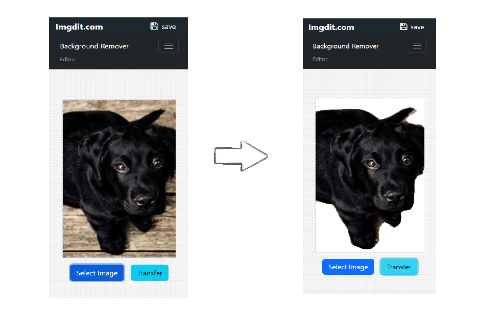
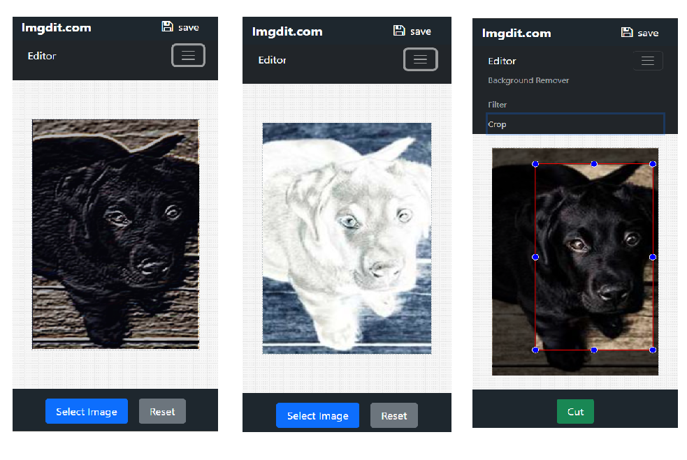

<h1 align="center">
  <br>
  <a href="http://www.amitmerchant.com/electron-markdownify"></a>
  <br>
 
</h1>


## Description

An online web editing service that can edit images and even remove backgrounds using AI.

### <a href="https://imgdit.com">https://imgdit.com</a>

<br>


## Utilizing AI feature using TensorFlow

We hosted AI feature using Firebase functions or AWS Lambda functions.



## Customizing Fabric.js

Implementing crop and filtering featurs by customizing fabric.js, a canvas library




## Getting Started

### Dependencies

* Chrome or Edge Browser
* Node.js
* NPM

### How To Run

To clone and run this application, you'll need [Git](https://git-scm.com) and [Node.js 18 or higher](https://nodejs.org/en/download/package-manager)

```bash
# Clone this repository
$ git clone https://github.com/tsukemandev/react-imgedit.git

# Go into the repository
$ cd react-imgedit

# Run npm install
$ npm install

# Run wep app
$ npm start

```


## Technology Stack

* Bootstrap (HTML, CSS)
* Fabric.js ( Drawing Canvas Lib )
* Javascript 
* React.js ( React-route-dom, React-Helmet )
* Python ( Background Remover AI )
* Firebase ( Hosting, AI Functions )


